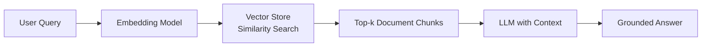

# Retrieval-Augmented Generation (RAG)

**Retrieval-Augmented Generation (RAG)** is a hybrid AI architecture that combines a [[Retrieval System|retrieval system]] with a [[Large Language Model|generative language model]]. It was popularized by the 2020 Facebook AI paper by Lewis et al.

RAG operates in two stages:
1. **Retrieval** — relevant documents are retrieved from a [[Vector Store|vector database]] using [[Embedding Model|embedding similarity search]].
2. **Generation** — the retrieved documents are passed as context to an [[Large Language Model|LLM]], which generates a grounded answer.

This approach grounds LLM outputs in factual, retrievable information, reducing hallucination and enabling access to external or updated knowledge without retraining.

---

## Key Components

- **[[Embedding Model]]** — converts text into dense vector representations (e.g., `text-embedding-ada-002`)
- **[[Vector Store]]** — indexes and retrieves embeddings via similarity search (e.g., Pinecone, Chroma, FAISS)
- **[[Large Language Model]]** — generates the final answer given the retrieved context (e.g., GPT-4, Claude)
- **[[Chunking Strategy]]** — determines how documents are split before embedding

---

## How It Works

1. A user submits a query.
2. The query is encoded into an embedding vector using the same [[Embedding Model]] used for the document corpus.
3. The [[Vector Store]] performs a similarity search (e.g., cosine similarity) to find the most relevant document chunks.
4. The top-k retrieved chunks are concatenated into a context prompt.
5. The [[Large Language Model]] receives this context along with the original query and generates a response grounded in the retrieved information.

---

## Limitations

- **Retrieval quality** depends heavily on the quality of the [[Embedding Model]] used.
- **No persistent learning** — every query starts from scratch; the model does not update its parameters based on retrieved information.
- **Latency** — the two-step retrieval + generation pipeline adds end-to-end latency compared to pure generation.

---

## See Also

- [[Embedding Model]]
- [[Vector Store]]
- [[Chunking Strategy]]
- [[Large Language Model]]
- [[Transformer]]
- [[Next-Token Prediction]]

---

## References

- Lewis, P., et al. (2020). *Retrieval-Augmented Generation for Knowledge-Intensive NLP Tasks*. Facebook AI Research. NeurIPS.
